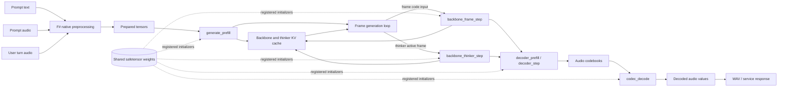
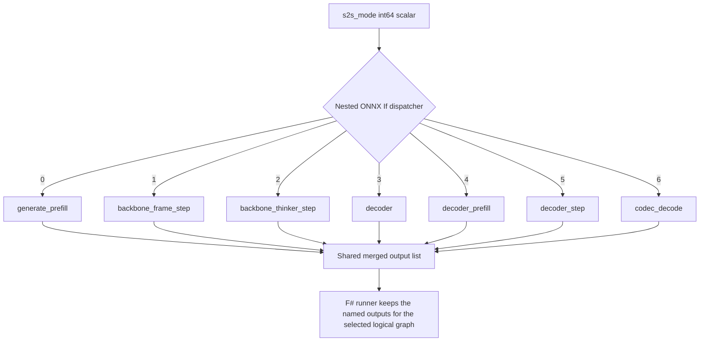
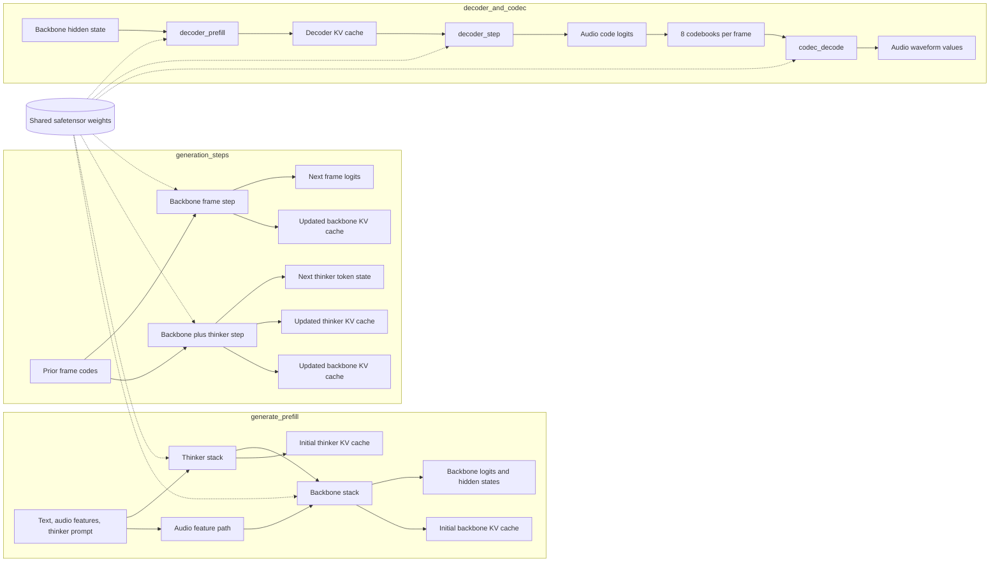
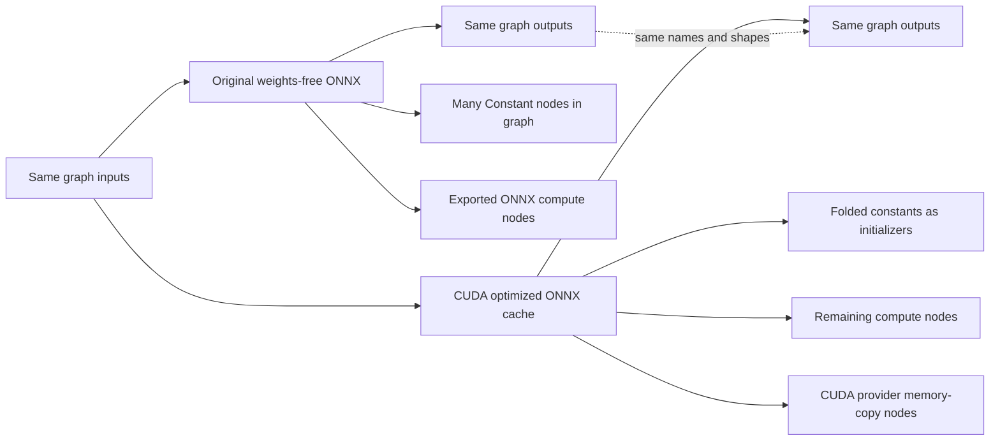

# Chroma S2S ONNX Simplified Diagrams

These diagrams collapse the large ONNX graphs into the subsystem blocks that matter when reading the runtime shape. They describe the local generated artifacts in this workspace, especially `onnx/chroma-s2s-full-v2` and `onnx/chroma-s2s-split-trt`.

## S2S Runtime Overview

## Merged S2S Dispatcher

The `chroma_s2s_merged.weights_free.onnx` file is small at the top level because it is a dispatcher. The real work is inside nested `If` branch graphs selected by the scalar `s2s_mode` input.

Each branch returns the same merged output list shape. Outputs that do not belong to the selected logical graph are filled with dummy branch outputs, so the top-level ONNX signature stays stable.

## Split Logical Graphs

The split S2S bundle exposes the same logical phases as separate ONNX files. The diagrams below intentionally hide repeated transformer layers, attention-mask plumbing, rotary math, reshapes, and cache tensor fan-out.

## Original vs CUDA Optimized Graph Shape

The optimized CUDA cache can look much smaller and more provider-specific than the original split graph, while preserving the same public callable contract.

Observed local split-graph examples:

| Logical graph | Original nodes | CUDA optimized nodes | Public I/O |
| --- | ---: | ---: | --- |
| `generate_prefill` | 20515 | 14084 | same |
| `codec_decode` | 2010 | 1299 | same |
| `decoder_prefill` | 1189 | 765 | same |
| `decoder_step` | 1170 | 761 | same |

The main visual difference is that ONNX Runtime folded many `Constant` nodes into initializers and added CUDA provider memory-transfer nodes such as `MemcpyFromHost` and `MemcpyToHost`. In this workspace, the TensorRT optimized `.onnx` files often match the local-external original structure more closely than the CUDA optimized files.

For `onnx/chroma-s2s-full-v2`, the merged original and the merged optimized cache both have the same tiny top-level dispatcher shape: `Constant`, `Equal`, and `If`. Their large graphs live inside nested branch graphs, so the top-level model view can be misleadingly simple.
