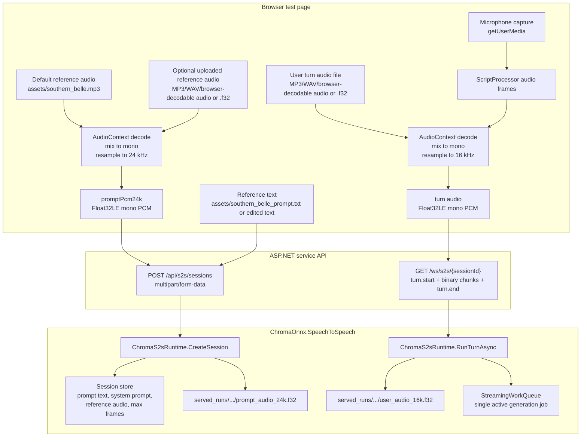
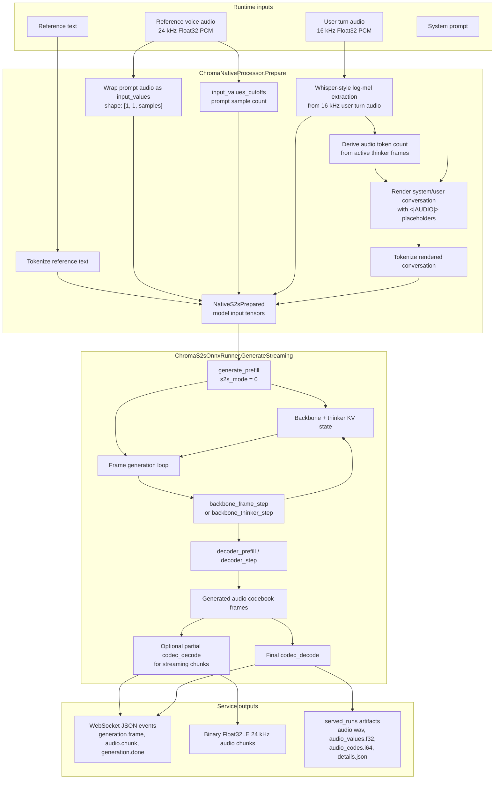

# Chroma S2S Audio Inflow

This diagram focuses on how audio enters the standalone F#/ONNX speech-to-speech service and becomes model-ready tensors, then streamed response audio. It covers both the reference voice prompt audio and the user turn audio because they enter the model through different paths.

## Browser To Runtime

## Native Preprocessing And ONNX Generation

## Important Rates And Boundaries

| Boundary | Format | Owner |
| --- | --- | --- |
| Reference voice prompt into session creation | Mono Float32 PCM at 24 kHz | Browser page sends `promptPcm24k`; runtime stores it on the session |
| User turn into WebSocket | Mono Float32 PCM at 16 kHz | Browser sends binary chunks after `turn.start` |
| Thinker audio features | Log-mel tensor plus attention mask | `ChromaNativeProcessor` |
| Response stream | Mono Float32 PCM at 24 kHz | `ChromaS2sOnnxRunner.GenerateStreaming` emits `audio.chunk` metadata followed by binary audio |
| Persisted preview | WAV plus raw `.f32` and codes | `ChromaS2sRuntime` under `served_runs` |

The key split is that reference audio conditions the voice through `input_values`, while user turn audio is transformed into thinker features that drive the assistant response generation.
